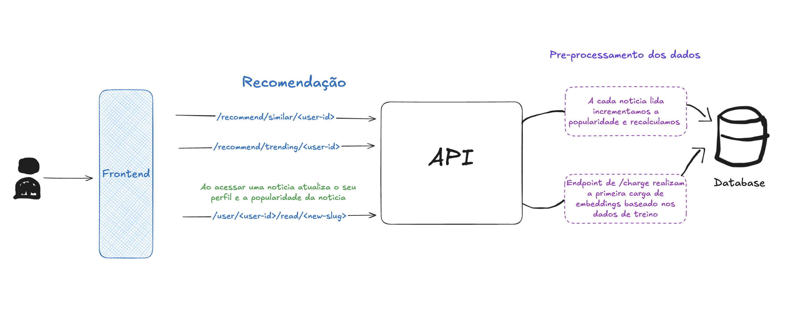

# Datathon Globo Recommendation

<p align="center">
  
  <p align="center">
  PROJETO DATATHON POS-TECH MLOPS
  </p>
</p>

Este repositório contém um sistema de recomendação de notícias construído para o desafio **PosTech Datathon Globo**. A solução combina **FastAPI**, **PostgreSQL** (com extensão **pgvector** para embeddings) e **BERT em português** para fornecer recomendações personalizadas de notícias.

---

## Índice

- [Datathon Globo Recommendation](#datathon-globo-recommendation)
  - [Índice](#índice)
  - [Principais Links](#principais-links)
  - [Visão Geral](#visão-geral)
  - [Abordagem do desafio](#abordagem-do-desafio)
    - [Componentes Principais](#componentes-principais)
    - [Estrutura do Projeto](#estrutura-do-projeto)
  - [Tecnologias e Dependências](#tecnologias-e-dependências)
  - [Como Executar Localmente](#como-executar-localmente)

---

## Principais Links

- [Apresentação do Projeto Youtube](https://youtu.be/gToJFxV3N1I)
- [URL da API Publica usando Google Cloud Run](https://datathon-api-globo-recommender-916602653960.us-central1.run.app/docs)

## Visão Geral

O objetivo principal é **prever e recomendar notícias** que cada usuário possa ler, considerando:

1. **Cold-start**: novos usuários ou notícias sem histórico.
2. **Recência**: notícias têm prazo de validade curto.
3. **Personalização**: recomendações baseadas no histórico e nos embeddings semânticos (BERT).

<p align="center">
  
  <p align="center">
  Diagrama Simplificado da Arquitetura
  </p>
</p>

## Abordagem do desafio

**O que, Por que, Como**

**O que?**

Pelo meu background ser mais de DevOps e Infraestrutura e atualmente estou iniciando na criação de RAG's internos no meu trabalho, decidi tentar usar uma abordagem diferente. Tentar utilizar um modelo pré-treinado com caracteristicas certas e usar recomendação usando consultas vetoriais de similaridade. Então teria um sistema de recomendação de notícias capaz de personalizar a experiência do usuário com base no histórico de leituras, combinando similaridade de conteúdo (via embeddings BERT) e aspectos colaborativos (popularidade).

**Por que?**

Cold-start: Precisamos de um método para recomendar itens mesmo sem histórico do usuário/notícia, usando conteúdo textual, o que me pareceu uma ótima oportunidade de utilizar representações vetoriais das noticiais.

Recência: Notícias têm validade curta, exigindo fator de tempo e popularidade na recomendação, conseguindo embarcar isso no mecanismo na lógica de recomendação poderiamos lidar bem com a recência.

Personalização: Permite atender a preferências únicas de cada leitor, melhorando a satisfação e o
engajamento e melhorando a recomendação conforme o engajamento do leitor.

**Como?**

Geração de embeddings: Usamos BERT em português para conseguir pegar melhor nuanceas da nossa linguagem, para transformar títulos/corpos das notícias em vetores semânticos (armazenados no PostgreSQL via pgvector).

Similaridade de Conteúdo: para usuários com histórico, calculamos o embedding do usuário (média das notícias lidas) e buscamos itens similares.

Tendências: combinamos popularidade (contagem de leituras) e recência (data de publicação) para promover  notícias atuais.

API: Disponibilizamos endpoints para inserir notícias, registrar leituras e retornar recomendações personalizadas.

### Componentes Principais

**- API FastAPI:** API com rotas para inserir notícias, registrar leituras e gerar recomendações.

**- PostgreSQL + pgvector:** Banco de Dados Relacional com uso de embeddings para buscas e comparações vetoriais.

**- BERT em PT-BR:** gera embeddings semânticos dos textos das notícias.

### Estrutura do Projeto

A seguir, a estrutura principal do projeto:

```bash
.
├── Dockerfile
├── Makefile
├── README.md
├── api
│   ├── main.py
│   └── routes
│       ├── healthcheck.py
│       ├── links.py
│       ├── news.py
│       ├── raw_data.py
│       ├── recommend.py
│       └── users.py
├── core
│   ├── bert_embeddings.py
│   ├── config.py
│   ├── database.py
│   ├── logging.py
│   ├── observability.py
├── db_models
│   ├── News.py.yml
│   ├── RawData.py
│   ├── User.pyments
│   └── __init__.pyipynb
├── docker-compose.yml
├── main.py
├── notebook-experiments
│   └── data_cleaning.ipynb
├── poetry.lock
├── pyproject.toml
├── schemas
│   ├── News.py
│   ├── Users.py
```

## Tecnologias e Dependências

- Python 3.10+
- FastAPI (Framework API)
- PostgreSQL + pgvector (Banco de dados + extensão para vetores)
- Docker e Docker Compose (Containerização e ambiente local)
- Make (Automação de scripts e padronizaçãod o setup)
- BERT PT-BR: neuralmind/bert-base-portuguese-casede dados PostgreSQL (com pgvector) e os demais serviços.
- SQLAlchemy (ORM)
- PyTorch (execução do modelo BERT)

## Como Executar Localmente

```bash
docker-compose up
make install
make run

# call /raw_data for load data to database
# call /news/charge and /users/charge for first input embeddings

# everything is ready for /recommend endpoints
```

Sobe o servidor FastAPI em <http://localhost:8000>.

Esse comando inicializa o banco de dados PostgreSQL (com pgvector) e os demais serviços.
