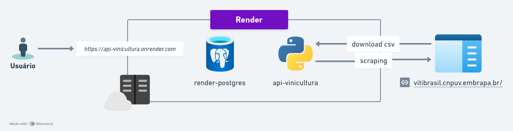
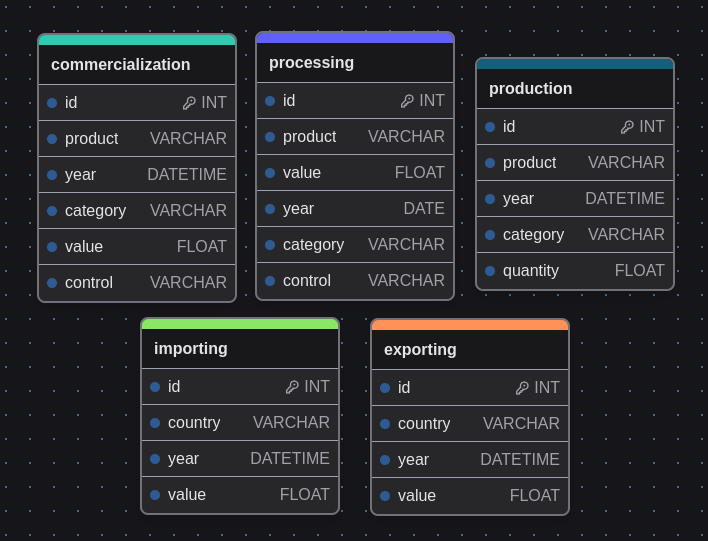

# FIAP - 1 Tech Challenge - 1MLET

<p align="center">
    
  <p align="center">
    Primeiro Tech Challenge da Pós-Tech de MLOps. Extraindo dados e expondo via API Embrapa.
  </p>
</p>

*Acesso ao-vivo! - https://api-vinicultura.onrender.com*

## Arquitetura de alto nível

<p align="center">
    
</p>

## Tecnologias utilizadas

- Python 3.9
- FastAPI
- Poetry
- Pydantic e SQLAlchemy
- Postgres
- BeautifulSoup

## Como os dados estão sendo extraidos

- Por conta das dificuldades e instabilidade que tinhamos no site da Embrapa.
- Optamos por fazer os scraping somente para obter os links dos CSV's e fazer do download localmente.
- Cada aba foi traduzida e transformada em um endpoint.
- Cada arquivo CSV é transformado em uma tabela no banco de dados.

## Modelagem do Banco de Dados

<p align="center">
    
</p>

## Executando localmente

``` bash
  poetry shell
  poetry install
  make run
```

## Deploy

Optamos por utilizar a plataforma [Render](https://render.com/) por possuir um ótimo free-tier.
