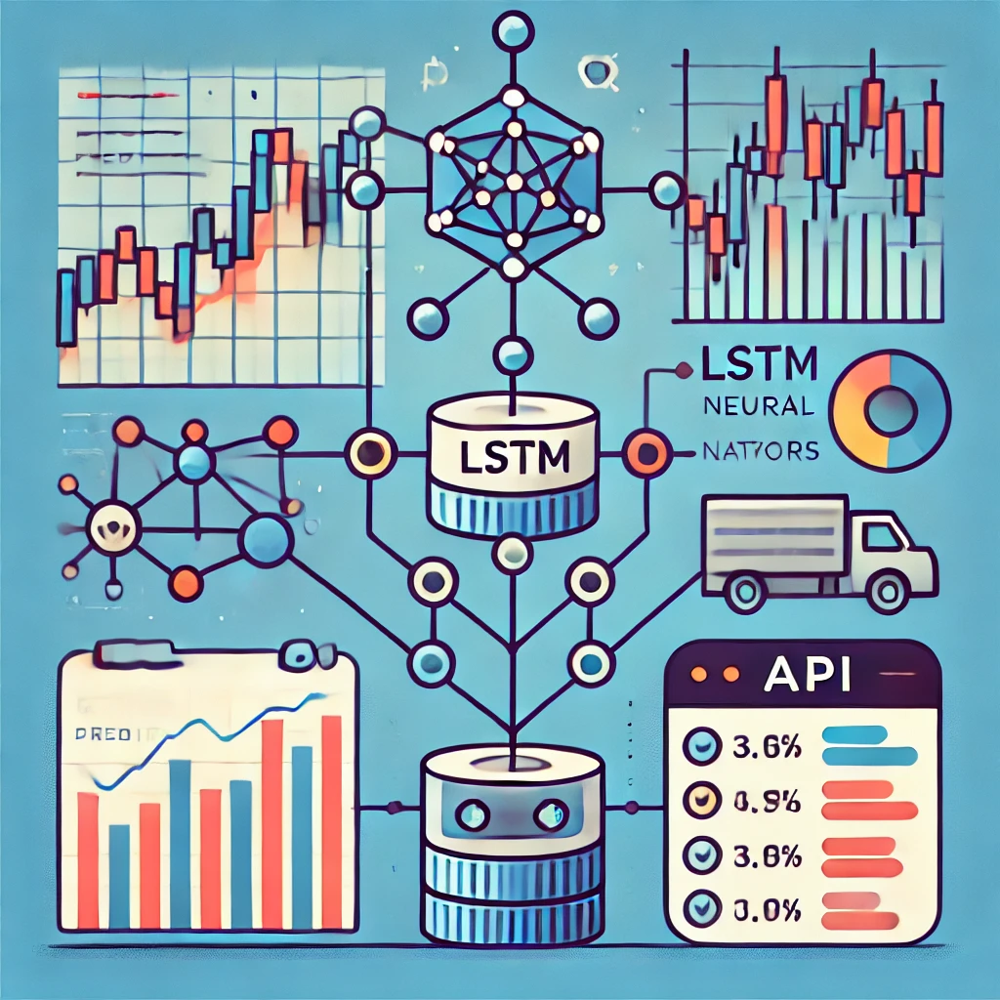

# Stock Price Prediction API using LSTM

<p align="center">
  
  <p align="center">
  Este projeto é parte do Tech Challenge da Fase 4 da pós-graduação, focado em Deep Learning e IA. O objetivo é desenvolver um modelo preditivo utilizando redes neurais LSTM (Long Short-Term Memory) para prever o valor de fechamento de uma certa ação na bolsa de valores.
  </p>
</p>

## Visão Geral do Projeto

O projeto implementa uma pipeline completa de machine learning, desde a coleta de dados até o deploy de uma API para previsão de preços de uma certa ação. O modelo utiliza redes neurais LSTM para capturar padrões temporais em dados históricos de preços de uma certa ação.

## Funcionalidades

- Coleta automática de dados históricos de uma certa ação via Yahoo Finance
- Pré-processamento e preparação dos dados para treinamento
- Modelo LSTM para previsão de preços
- API RESTful para servir previsões
- Observabilidade de performance do modelo em produção


## Principais Links

- [Apresentação do Projeto Youtube](link-para-documentacao)
- [URL da API Publica no Railway](link-para-video)

## Estrutura do Projeto

- `api/`: Código da API e rotas do serviço
- `assets/`: Recursos estáticos do projeto
- `core/`: Componentes principais do sistema
- `datasources/`: Fontes de dados e integrações
- `training_models/`: Modelos de machine learning e scripts de treinamento
- `schemas/`: Definições de schemas e modelos de dados
- `utils/`: Funções utilitárias e helpers
- `main.py`: Ponto de entrada da aplicação
- `pyproject.toml` e `poetry.lock`: Gerenciamento de dependências com Poetry
- `prometheus.yml`: Configuração do Prometheus para monitoramento

## Tecnologias Utilizadas

- Python 3.10
- PyTorch para o modelo LSTM
- FastAPI para a API REST
- Poetry para gerenciamento de dependências
- Docker para containerização
- yfinance para coleta de dados
- Pandas e NumPy para manipulação de dados
- Scikit-learn para métricas e processamento
- MLflow para gerenciamento de experimentos e modelos
- OpenTelemetry para observabilidade

## Configuração e Instalação

1. Clone o repositório
2. Instale as dependências:
```bash
poetry shell
poetry install
```
3. Suba os containers:
```bash
docker compose up -d
```
4. Execute a API:
```bash
make run
```

## Uso da API

Pode acessar a documentação da API em http://localhost:8080/docs.
E e utilizar os endpoints atraves da interface OpenAPI.

## Métricas de Avaliação

O modelo é avaliado usando as seguintes métricas:
- MAE (Mean Absolute Error)
- RMSE (Root Mean Square Error)
- MAPE (Mean Absolute Percentage Error)

Todas registradas no MLFlow e Prometheus.

## Monitoramento

O sistema inclui monitoramento de:
- Tempo de resposta da API
- Acurácia das previsões
- Utilização de recursos
- Logs de erros e exceções

Com a adição do uso de Tracing via OpenTelemetry.

## Autor

[Gabriel Dantas](https://gdantas.com.br)
